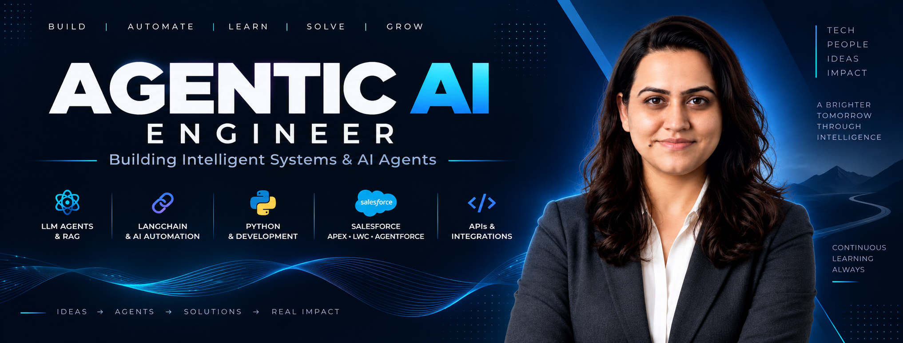

<h1 align="center">Hi 👋, I'm Rupali Chouksey</h1>

<h3 align="center">Salesforce Developer • Agentic AI Engineer • AI Automation Builder</h3>

<p align="center">
  <a href="https://www.linkedin.com/in/rupali-chauksey/">
    
  </a>
  <a href="mailto:rupalichauksey@gmail.com">
    
  </a>
  <a href="https://github.com/rupali-chauksey">
    
  </a>
</p>

<p align="center">
  
</p>

<p align="center">
  <strong>
    Building intelligent systems where enterprise CRM meets Agentic AI.<br/>
    From Salesforce automation to multimodal AI, RAG pipelines and autonomous workflows.
  </strong>
</p>

<p align="center">
  
  
  
  
  
  
</p>

---

## 🧠 About Me

<table>
  <tr>
    <td width="68%" valign="middle">

```python
class RupaliChouksey:
    role = "Salesforce Developer & Agentic AI Engineer"
    experience = "3+ Years in Salesforce Ecosystem"
    focus = ["Agentic AI", "RAG", "LLM Orchestration",
             "Salesforce", "Agentforce", "CRM Automation"]

    currently_building = "AI agents + intelligent business workflows"

    philosophy = "The future of CRM isn't automation — it's autonomy."
```

- 🤖 Building **Agentic AI systems** that can reason, plan, use tools and execute multi-step workflows
- ☁️ Working across **Salesforce, Apex, LWC, integrations and Agentforce**
- 📚 Exploring **RAG pipelines, LLM orchestration and multimodal AI**
- ⚙️ Connecting AI with real business workflows instead of building isolated demos
- 🚀 Focused on practical, production-minded AI engineering and automation

    </td>
    <td width="32%" align="center" valign="middle">
      
      <br/><br/>
      <strong>Salesforce Developer × Agentic AI Engineer</strong>
    </td>
  </tr>
</table>

---

## 🚀 What I Build

| 🤖 Agentic AI | ☁️ Salesforce + AI |
|---|---|
| Autonomous agents, tool calling, multi-step workflows and LLM orchestration | Agentforce, Apex, LWC and intelligent CRM automation |

| 📚 RAG & Knowledge Systems | 🎥 Multimodal AI |
|---|---|
| Retrieval pipelines, grounded responses and knowledge assistants | Voice + image + video workflows with validation and safety controls |

---

## ⭐ Featured Projects

### 🩺 [Skinova Clinical Intelligence](https://github.com/rupali-chauksey/skinova-clinical-intelligence)
**Multimodal AI Skin Consultation Assistant**

A portfolio AI system combining **voice, skin image and video inputs** with a Vision-Language Model, deterministic Python validation, confidence-aware output and voice responses.

**Engineering highlights**
- 🎥 Multimodal **voice + image + video** workflow
- 🧠 **Qwen3.6-27B via Groq** for vision-language analysis
- 🛡️ Deterministic Python **image/video body-part validation gate**
- 📊 Confidence-aware output: High / Medium / Low / Not Assessed
- 🔊 Speech-to-text + text-to-speech workflow
- 🐳 Dockerized and deployment-ready architecture

**Tech:** `Python` `Gradio` `Qwen3.6-27B` `Groq` `OpenCV` `Pillow` `Deepgram` `Docker`

> **Note:** Skinova is a portfolio/engineering project and is not a medical diagnostic system.

**[View Project →](https://github.com/rupali-chauksey/skinova-clinical-intelligence)**

---

### 🔗 More Projects Coming Soon

More Agentic AI, Salesforce and automation projects will be added here as they are published.

---

## 🧩 Core Tech Stack

### 🤖 Agentic AI, LLMs & Automation
     

### ☁️ Salesforce Ecosystem
    

### 🧠 AI / ML & Data
     

### 🛠️ Tools & Platforms
     

---

## 📊 GitHub Analytics

<p align="center">
  
  
</p>

<p align="center">
  
</p>

<p align="center">
  
</p>

<p align="center">
  
  
  
</p>

> **GitHub activity:** This profile highlights projects I build and ship across Salesforce, Agentic AI, automation and applied AI engineering.

---

## 🐍 Contribution Snake

<p align="center">
  
</p>

<p align="center">
  
</p>

---

## 🎯 Currently Deepening

- 🤖 Advanced **multi-agent orchestration** and autonomous workflow design
- ☁️ **Agentforce + Salesforce** AI patterns
- 📚 Scalable **RAG and knowledge retrieval** systems
- 🔗 LLM ↔ Salesforce integrations using APIs, Apex and automation
- 🎥 Multimodal AI workflows with stronger validation and safety layers

## 🤝 Open to Collaborate On

- Agentic AI systems for business process automation
- Salesforce + AI hybrid solutions
- RAG-based knowledge assistants
- AI-powered CRM workflows and integrations

---

<p align="center">
  <strong>⚡ Building where CRM meets autonomous intelligence.</strong><br/>
  <sub>Let's connect and build something intelligent.</sub>
</p>
