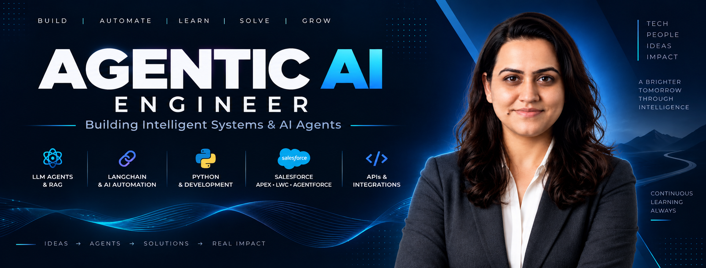

<h2 align="center">
  <a href="https://git.io/typing-svg">
    
  </a>
</h2>

<div align="center">
  
</div>

---

<h3 align="center">
  <b>🧠 Salesforce Developer</b> • <b>⚙️ Agentic AI Engineer</b> • <b>🔧 AI Automation Builder</b>
</h3>

<p align="center">
  <strong>Building intelligent systems at the intersection of Salesforce and Agentic AI</strong>
  <br/>
  <em>From enterprise CRM automation to autonomous agents, RAG pipelines, and multimodal AI workflows</em>
</p>

<p align="center">
  <a href="https://www.linkedin.com/in/rupalichauksey/" target="_blank">
    
  </a>
  <a href="https://github.com/rupali-chauksey">
    
  </a>
  <a href="mailto:rupalichauksey@gmail.com">
    
  </a>
  <a href="https://twitter.com/rupalichauksey" target="_blank">
    
  </a>
</p>

<p align="center">
  
  
  
  
</p>

---

## 🧠 About Me

```python
class RupaliChauksey:
    role = "Salesforce Developer & Agentic AI Engineer"
    experience = "3+ Years in Salesforce Ecosystem"
    focus = [
        "Agentic AI Systems",
        "LLM Orchestration & RAG",
        "Salesforce & Agentforce",
        "Multimodal AI Workflows",
        "Business Process Automation"
    ]

    currently_building = "AI agents + intelligent business workflows"
```

### 🎯 What I Do

- **🤖 Agentic AI Systems:** Design and deploy autonomous agents that can reason, plan, use tools, and execute multi-step workflows
- **☁️ Salesforce Integration:** Build enterprise Salesforce solutions with AI capabilities using Agentforce, Apex, and LWC
- **📚 RAG & LLM Engineering:** Create production-ready RAG pipelines with multimodal inputs and confidence-aware responses
- **⚙️ Business Automation:** Connect AI with real workflows and business processes, not isolated demos
- **🚀 Practical Implementation:** Focus on deployable, scalable solutions with real-world impact

---

## 🚀 Building With

| 🤖 Agentic AI & Autonomous Workflows | ☁️ Salesforce & Agentforce |
|---|---|
| Autonomous agents, tool calling, multi-step workflows, autonomous browsing and task execution | Agentforce solutions for hotel booking, check-in/out, food ordering, and customer assistance |
| **🧠 LLM, RAG & Multimodal AI** | **🔗 AI Integrations & Automation** |
| LLM-powered RAG pipelines with PDF + web fallback, multimodal AI using voice/image/video, grounded and confidence-aware responses | APIs, webhooks, tool integration, and workflow orchestration across AI and business systems |
| **⚙️ AI Automation & App Engineering** | **🧩 Knowledge & CRM Applications** |
| Intelligent workflow automation, backend orchestration, validation, and production-minded AI applications | Knowledge assistants, document retrieval, and AI-powered business workflows |

---

## ⭐ Featured Projects

<table>
  <tr>
    <td>
      <h3>🩺 <a href="https://github.com/rupali-chauksey/skinova-clinical-intelligence">Skinova Clinical Intelligence</a></h3>
      <strong>Multimodal AI Skin Consultation Assistant</strong>
      <br/><br/>
      A portfolio AI system combining <strong>voice, skin image, and video inputs</strong> with a vision-language model, deterministic Python validation, confidence-aware output, and voice responses.
      <br/><br/>
      <strong>Engineering highlights</strong>
      <ul>
        <li>🎥 Multimodal <strong>voice + image + video</strong> workflow</li>
        <li>🧠 <strong>Qwen3.6-27B via Groq</strong> for vision-language analysis</li>
        <li>🛡️ Deterministic Python <strong>image/video body-part validation gate</strong></li>
        <li>📊 Confidence-aware output: High / Medium / Low / Not Assessed</li>
        <li>🔊 Speech-to-text + text-to-speech workflow</li>
        <li>🐳 Dockerized and deployment-ready architecture</li>
      </ul>
      <strong>Tech:</strong> <code>Python</code> <code>Gradio</code> <code>Qwen3.6-27B</code> <code>Groq</code> <code>OpenCV</code> <code>Pillow</code> <code>Deepgram</code> <code>Docker</code>
      <br/><br/>
      <em>Note: Skinova is a portfolio/engineering project and is not a medical diagnostic system.</em>
      <br/><br/>
      🔗 <a href="https://github.com/rupali-chauksey/skinova-clinical-intelligence"><strong>View Repository →</strong></a>
    </td>
  </tr>
</table>

<table>
  <tr>
    <td>
      <h3>📄 <a href="https://github.com/rupali-chauksey/intellidocs-ai-enterprise-rag-mcp">IntelliDocs AI — Enterprise RAG + MCP</a></h3>
      <strong>Enterprise Document Intelligence Platform</strong>
      <br/><br/>
      An enterprise-grade RAG system that connects document knowledge to AI agents via the Model Context Protocol (MCP), enabling grounded, permission-aware retrieval over enterprise document corpora.
      <br/><br/>
      <strong>Engineering highlights</strong>
      <ul>
        <li>📚 Retrieval-Augmented Generation pipeline over enterprise documents</li>
        <li>🔌 <strong>MCP integration</strong> for standardized agent-to-tool communication</li>
        <li>🧠 Grounded, citation-aware responses to reduce hallucination</li>
        <li>🏢 Built for enterprise-scale knowledge retrieval workflows</li>
      </ul>
      <strong>Tech:</strong> <code>Python</code> <code>RAG</code> <code>MCP</code> <code>LangChain</code> <code>Vector DB</code>
      <br/><br/>
      🔗 <a href="https://github.com/rupali-chauksey/intellidocs-ai-enterprise-rag-mcp"><strong>View Repository →</strong></a>
    </td>
  </tr>
</table>

<table>
  <tr>
    <td>
      <h3>🏭 <a href="https://github.com/rupali-chauksey/indusguard-ai">IndusGuard AI — Agentic AI for Industrial Intelligence</a></h3>
      <strong>Autonomous Manufacturing Intelligence & Multi-Agent Orchestration</strong>
      <br/><br/>
      Enterprise-grade agentic manufacturing platform for predictive maintenance, anomaly detection, and autonomous mitigation planning. Combines deterministic analytics, isolation forest anomaly detection, gradient-boosted RUL forecasting, spatial 3D digital twin, and Human-in-the-Loop (HITL) governance.
      <br/><br/>
      <strong>Engineering highlights</strong>
      <ul>
        <li>🤖 <strong>Multi-Agent Orchestration</strong>: Diagnostic, Predictive, and Planning agents for autonomous intelligence</li>
        <li>📊 <strong>47+ Hour RUL Predictions</strong> with Monte Carlo scenario simulation and failure probability forecasting</li>
        <li>🔍 <strong>Isolation Forest Anomaly Detection</strong> on multi-variate industrial telemetry streams</li>
        <li>🎯 <strong>Spatial 3D Digital Twin</strong> with temporal time-travel from historical outages to predicted failures</li>
        <li>🛑 <strong>Human-in-the-Loop Governance</strong>: Role-based RBAC for operator/supervisor/plant-head approvals</li>
        <li>💰 <strong>Proven ROI</strong>: 1,008% Year 1 ROI | ₹18.4L saved in 6-month field trial | 34% unplanned downtime reduction</li>
      </ul>
      <strong>Tech:</strong> <code>Python 3.11+</code> <code>Streamlit</code> <code>Groq Cloud (120B LLM)</code> <code>ChromaDB</code> <code>scikit-learn</code> <code>Plotly 3D</code> <code>NetworkX</code> <code>SQLite Audit</code> <code>Docker</code>
      <br/><br/>
      🔗 <a href="https://github.com/rupali-chauksey/indusguard-ai"><strong>View Repository →</strong></a>
    </td>
  </tr>
</table>

<p align="center"><sub>📂 More projects on my <a href="https://github.com/rupali-chauksey?tab=repositories">GitHub repositories</a></sub></p>

---

## 🧩 Core Tech Stack

### 🤖 Agentic AI & LLM Engineering


### ☁️ Salesforce & Agentforce


### 🧠 LLMs, Multimodal AI & Voice


### ⚙️ Automation, Tool Calling & Workflow Engineering


### 📊 AI / ML & Data


### ☁️ Cloud, Deployment & Dev Tools


---

## 📊 GitHub Stats

<p align="center">
  
  
</p>

<p align="center">
  
</p>

---

## 🤝 Let's Connect & Open Opportunities

I'm actively open to:

- 🤖 **AI Engineer / Agentic AI Engineer** roles
- ☁️ **Salesforce AI / Agentforce** specialist positions
- 🔗 **AI + Salesforce** engineering roles
- 📚 **RAG & Knowledge Assistant** systems
- 🤝 **Technical consulting** for AI/Salesforce projects

| Channel | Link |
|---------|------|
| **Email** | rupalichauksey@gmail.com |
| **LinkedIn** | [/in/rupalichauksey](https://www.linkedin.com/in/rupalichauksey/) |
| **Twitter** | [@rupalichauksey](https://twitter.com/rupalichauksey) |
| **GitHub** | [rupali-chauksey](https://github.com/rupali-chauksey) |
